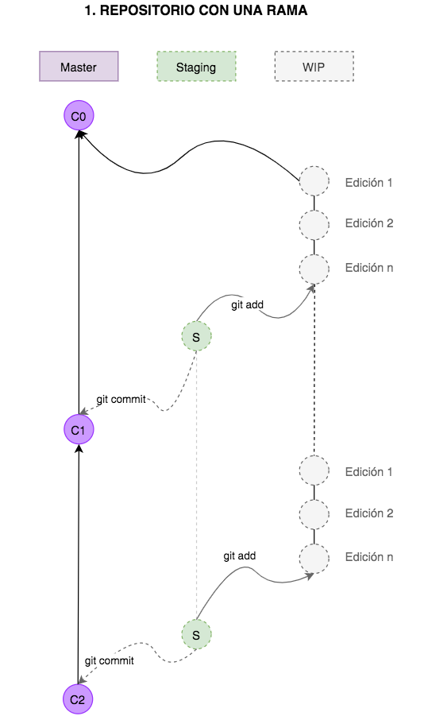
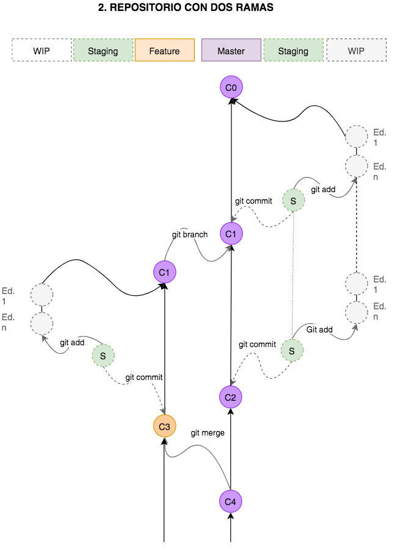
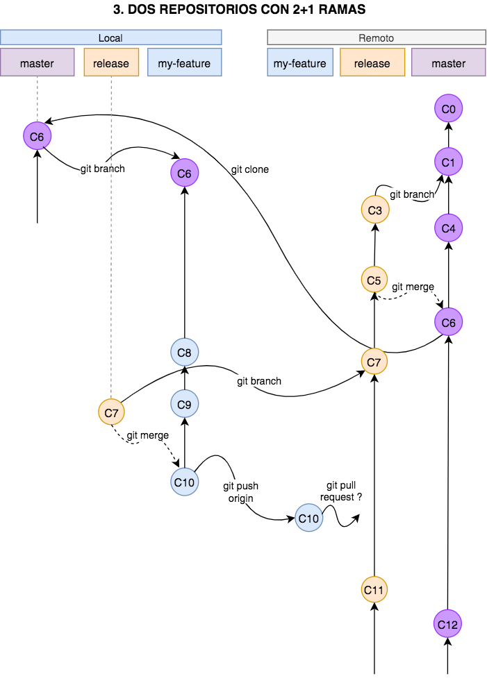

# GUIA BASICA PARA USAR GIT
## QUE ES GIT?
Git es un sistema distribuido de control de versiones (SDCV) que nos ayuda a trabajar en equipo cuando
vamos a llevar a cabo proyectos complejos donde una o varias personas pueden aportar con muchas ideas y se hace necesaria una estrategia para poder gestionar los cambios y el avance del proyecto.

## PORQUE ES NECESARIO USAR GIT?
Si alguna vez intentaste realizar un ensayo final para una tarea de la escuela, seguramente puedes recordar que tuviste 
que abrir y guardar el documento multiples veces: cuando lo creaste y pusiste el primer título, cada vez que fuiste
agregando un parrafo nuevo, cuando cambiaste un titulo que ya no te gusto, o cuando se lo
pasaste a algunas personas para que lo revisen y te sugieran correcciones. Si la tarea de mantener un relativo orden de todos estos cambios y versiones
ya te parece compleja, imagina como sería si el ensayo lo hubieran tenido que escribir entre todos tus compañeros de clase.
Seguramente hubiera sido un caos y habria sido practicamente imposible realizarlo.
Para salvar este tipo de situaciones y hacer humanamente posibles tareas que hubieran sido impensables un par de siglos atrás, es que se invento GIT.

## GUÍA PASO A PASO

### 📋 Instalar GIT
Dependiendo del sistema operativo que estes usando, la instalacion será un poco diferente, pero puedes consultar toda
esta informacion en la [página](https://git-scm.com/downloads) de Git.

### 📋 Crear un repositorio
Lo primero que debemos hacer es crear un repositorio, que es como un directorio donde se guardan archivos, pero que tiene el super
poder especial de controlar todo lo que en él sucede (sistema de control de versiones).
Para esto creas una carpeta o directorio con el nombre que quieras y te posicionas dentro de el desde la consola.
Aqui ejecutas el comando: 

- git init

lo que hará sera iniciar el repositorio en el directorio actual, creando algunos archivos invisibles. Para verificar que fue creado, puedes 
ejecutar el comando:

- git status

Que te dara informacion del estado del repositorio. Puedes ejecutar esta línea las veces que quieras para verificar los avances que vas haciendo.

### 📋 Crear archivos
Ahora puedes crear uno o varios archivos que son los que irás cambiando y administrando (sus cambios) con GIT. Como ejemplo puedes crear un archivo de texto que se llame ensayo con la siguiente línea en consola:
- touch ensayo.txt

Luego puedes abrir este archivo y escribir en él todo lo que quieras. Una vez hayas terminado, lo guardas y puedes revisar el estado del repositorio. Te daras cuenta que esta vez aparece un mensaje diferente.

### 📋 Manejo del repositorio
Es posible tener más de un repositorio en diferentes lugares y mantenerlos a todos sincronizados. Algunas plataformas nos permiten almacenar en ellas repositorios online, lo que se hace muy conveniente para trabajar con personas que no estén fisicamente en el mismo lugar, de esta manera pueden usar la red y el internet para acceder a los archivos el momento que necesiten. Para que puedas comprender mejor el proceso de manejo de los repositorios, primero veremos el manejo de un solo repositorio.

#### 💡 Un repositorio, una rama
Retomemos el último comando, justo despues de que creaste tu primer archivo ensayo.txt para escribir tu tarea de redactar un ensayo. Observa el primer gráfico. Veras que la estructura deL repositorio tiene tres lineas imaginarias paralelas, que he dibujado para poder explicarte mejor: 
- WIP = (work in progress)
- STAGING
- MASTER 

Si en este momento abres el archivo de texto y empiezas a modificarlo, comienzas automaticamente a trabajar en la linea de WIP. Una vez termines de escribir todo lo que desees, seguramente guardaras tu archivo y lo cerrarás. Pero aun seguiras en la línea de work in progress y nada habra cambiado aun en el registro del repositorio. Para que esto suceda, primero debes enviar tu trabajo a la línea de "staging" con el comando:

- git add ensayo.txt

El area de staging es de preparacion **previa** a los cambios **definitivos** en el repositorio. Si en este punto olvidaste que aun querías agregar unas lineas mas a tu ensayo, puedes repetir el proceso anterior. Abrirlo, escribir, guardar y luego mandarlo a la linea de staging con el comando señalado.
Si estas trabajando con varios archivos a la vez, tambien puedes usar el comando:

- git add .
que enviara a todos los archivos que se estan monitoreando en el repositorio al area de staging.

Ahora ya terminaste de escribir, ya mandaste los archivos al area de staging y estas listo para guardar los cambios de forma **definitiva** en el repositorio. Esto se hace ejecutando el comando:

- git commit -m "Introduccion y primer borrador del ensayo"

El texto que esta entre comillas es un mensaje de creacion libre, que se adjunta a los cambios realizados para tener una idea **resumida** de cuáles fueron los cambios que se hicieron en esa actualización. Ahora los cambios que realizaste ya pasaron a estar oficialmente registrados en el repositorio, que guarda un historial de todos los cambios realizados desde que lo creaste. Para tener un acceso a este historial puedes ejecutar el comando:

- git log

que te mostrará en la consola una lista de todos los cambios que se han hecho en el repositorio desde su creacion.

#### 💡 Un repositorio, dos ramas

También es posible tener dos ramas de trabajo en un repositorio. De esta manera, tu y un amig@ podrian trabajar simultáneamente en desarrollar tu ensayo, cada uno en una rama, y cuando hayan terminado pueden juntar las dos ramas. Para esto primero debemos crear la nueva rama, con el comando:

- git branch feature

En este caso la nueva rama se llama **feature** pero puedes elegir el nombre que quieras. Si observas el grafico, veras que ahora tenemos dos ramas de trabajo, cada una con su respeciva línea de staging y de trabajo en proceso (wip).
Para hacer cambios desde la nueva rama, primero deberas pararte en ella. Esto se hace con el comando:

- git checkout feature

Ahora puedes comenzar a hacer los cambios, tal como lo explicamos en la anterior sección. Es posible que tanto la persona que esta parada en la rama master, como la que esta en la rama feature, realicen cambios de manera simultánea. Para saber en que rama estas parado puedes usar el comando:

- git branch

y para ver todas las ramas:

- git branch -a

Cuando terminen de hacer todos los commits necesarios de esa etapa de avance del proyecto, pueden juntar las dos ramas. Para eso primero debes parte en la rama principal con el comando:

- git checkout master

y luego traes todos los cambios de la otra rama con el comando:

- git merge feature

si hay algun conflicto el sistema te guiara sobre como resolverlo, o lo puedes mirar [aqui](https://www.youtube.com/watch?v=xNVM5UxlFSA), si decides cancelar el proceso de integrar la rama feature a la rama actual, master, puedes escribir el siguiente comando:

- git merge --abort

#### 💡Repositorio local y repositorio remoto

Muchas veces será necesario manejar un repositorio remoto, especialmente si hay varias personas trabajando en un proyecto. En esta seccion explicaremos como trabajar con un repositorio remoto, asumiendo que como desarrolladores no tenemos acceso a la rama master del repositorio remoto y que debemos solicitar permiso para hacer los cambios.

En primer lugar debemos ir a nuestro directorio de trabajo e importar el repositorio remoto, con el comando:

- git clone https://github.com/ValentinaBacherer/JSFS-2020-11-M-GIT-II.git 

donde debemos indicar la direccion donde se guarda el repositorio. Esto importara un directorio con los archivos adentro, por lo tanto debemos ingresar al directorio, con el comando (usar el nombre correspondiente de la carpeta del repositorio):

- cd JSFS-2020-11-M-GIT-kata

para saber en que rama estamos, podemos ejecutar el comando anteriormente señalado, que nos dira que estamos en master o main. Como no podemos hacer los cambios directamente en la rama master, y tampoco en la rama release, debemos crear una rama auxiliar para implementar nuestra nueva feature. Creamos la rama my-feature y nos paramos en ella con un solo comando:

- git checkout -b my-feature

Ahora podemos hacer todos los cambios necesarios en la nueva rama, utilizando los comandos mencionados en las anteriores secciones. Cuando hayamos terminado de trabajar en my-feature, debemos integrar nuestros cambios con la rama release, resolver conflictos si hubieran y realizar un pull request para que el encargado de adminstrar esa rama en el repositorio remoto pueda revisar y aceptar nuestros cambios.
Primero nos paramos en la rama release y nos aseguramos que este actualizada con el comando:

- git pull origin release

Luego nos paramos nuevamente en la rama my-feature y le incorporamos la informacion de release que acabamos de actualizar:

- git merge release

Si hubieran conflictos, debemos resolverlos. Por último, subimos nuestra rama al repositorio con el comando:

- git push -set-upstream origin my-feature

y creamos un pull request con la direccion que nos sugiere git, en este caso https://github.com/ada-school/JSFS-2020-11-M-GIT-kata/pull/new/my-feature. Aca debemos asignar un encargado para la revision del request. Frases útiles: PTAL , WDYT, LGTM.

#### 💡Otros comandos útiles

Para configurar tu nombre de usuario en git, corremos el comando:

- git config --global user.name "Nombre Apellido"
- git config --global user.email "Nombre@gmail.com"
- git config --list  

El ultimo comando es para ver como lo tienes configurado.

- git init

Para inicializar un repositorio de manera local. 

- git -alh

Para ver todos los archivos del directorio actual, incluyendo los invisibles. Para que git ignore archivos, creamos un archivo que se llame .gitignore y adentro escribimos el nombre del archivo que no queremos que tome en cuenta.

- git rm --cached archivo

Para sacar un archivo del staging.

- git diff

Te muestra las diferencias entre lo que esta en el repositorio (local) y lo que esta en WIP

- $ git remote add origin https://github.com/user/repo.git

Sincroniza un repositorio remoto con tu repositorio local.

- git remote -v
Verificar el repositorio remoto.
